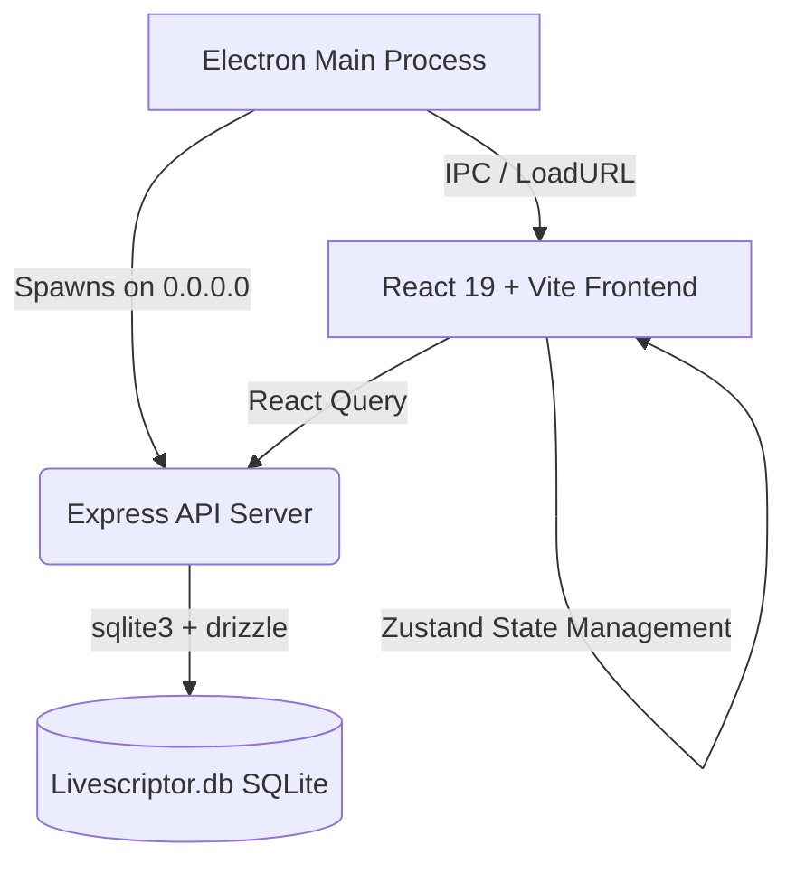

<div align="center">
  

  <h1>Softcurse LiveScriptor</h1>
  <p><strong>Advanced Next-Gen Desktop IDE Environment</strong></p>

  <p>
    
    
    
    
    
  </p>

  <p>
    <a href="https://softcurse-website.pages.dev/"><strong>Softcurse Official Website</strong></a> | 
    <a href="https://softcurse-website.pages.dev/lab/livescriptor"><strong>LiveScriptor Product Page</strong></a>
  </p>
</div>

<p align="center">
  A production-ready, standalone Electron desktop application engineered for seamless native development. Combining a stunning cyberpunk visual aesthetic with high-performance integrated tools, LiveScriptor delivers an unparalleled coding experience exclusively tailored for modern workflows.
</p>

---

## ✨ Core Capabilities

LiveScriptor is fully detached from legacy web-hosted constraints, featuring a robust, local-first architecture powered by SQLite and Node.js.

- **Intelligent Monaco Editor:** Industry-standard syntax highlighting, bracket matching, and integrated IntelliSense powered by the Monaco engine.
- **Unified Multi-Format Project Ingestion:** Seamlessly clone remote Git repositories, ingest absolute local directory paths, or natively extract `.zip` archives directly from your hard drive with a single unified interface.
- **Dynamic AI Assistant Integration:** Communicate natively with a versatile AI copilot. Configure your own API keys to leverage industry-leading models including **OpenAI, OpenRouter, Google Gemini, and Grok (xAI)**—all securely persisted in your local SQLite database.
- **Integrated Native Terminal:** Execute shell commands fluidly. Natively configured to utilize PowerShell on Windows, seamlessly translating standard POSIX commands (`ls`, `pwd`, etc.) for immediate cross-platform compatibility.
- **Instant Live Preview:** Split-pane development environment giving you real-time rendering of your HTML/CSS/JS, React (Vite), and Node.js server architectures.
- **Cyberpunk Visual Paradigm:** A deeply atmospheric workspace featuring a 3D animated synthwave grid horizon, subtle ambient space panning, and micro-interaction glitch effects built on Tailwind CSS v4 and Framer Motion.
- **Granular Command Palette:** Lightning-fast fuzzy file searching and command execution via `Ctrl+P`.
- **Global Project Search:** Traverse your entire project tree instantly with precise regex and case-sensitive querying capabilities.
- **Postman-style HTTP Client:** Construct, test, and save complex API requests directly from alongside your code.

## ▶️ Usage & Demonstration


**Quick Workflow:**
1. Boot the Application.
2. Click **Clone Git Repo** to instantly pull your code.
3. Open the Sidebar to access the File Explorer.
4. Hit `Ctrl+S` to format and save perfectly formatted React, Node, or vanilla web code.

## 🏗️ Technical Architecture



- **Desktop Shell:** Electron V33
- **Frontend Assembly:** React 19, Vite, Tailwind CSS v4, Lucide Icons, Radix UI Primitives
- **Editor Engine:** Microsoft Monaco
- **API & Backend Layer:** Express.js Native
- **Persistence Layer:** `better-sqlite3` strictly-typed via `drizzle-orm` (auto-managed at `%AppData%/Roaming/softcurse-livescriptor/livescriptor.db`)
- **Package Management & Tooling:** pnpm monorepo workspaces

## 🚀 Getting Started

### System Prerequisites
Ensure you meet the specifications outlined in `requirements.txt`:
* **Node.js** v20.0.0 or higher
* **pnpm** v9.0.0 or higher
* **Windows 10/11** (Primary Target Environment)

### Development Initialization

1. **Install Monorepo Dependencies**
   ```powershell
   pnpm install
   ```

2. **Launch the Development Matrix**
   Execute the Electron shell alongside the Vite hot-reloading pipeline and local Express backend.
   ```powershell
   pnpm run electron:dev
   ```

## ⚙️ Configuration & Configuration Management

LiveScriptor securely retains all personal IDE settings, project states, and AI provider configurations strictly on your local machine.

* Access the **Settings Panel** via the internal IDE `MenuBar` (click the gear icon).
* Configure your primary **AI API Secret Keys** uninhibited by centralized cloud proxies.
* Tune IDE features like Minimap rendering, automatic save intervals, and typeface sizing.

## 📦 Production Builds

Generate the final, standalone, zero-dependency Windows executable. The pipeline uses `esbuild` for CJS backend compilation and `electron-builder` to package the NSIS installer.

```powershell
pnpm run electron:build
```

Upon success, an immutable executable installer will be available inside the generated `release/` directory.

## 🤝 Contributing & Community
We welcome all netrunners! Please read our [CONTRIBUTING.md](CONTRIBUTING.md) for details on our code of conduct, and the process for submitting pull requests to us. 

See the [CHANGELOG.md](CHANGELOG.md) to dive into version history and release notes.

---
*Architected and maintained by **Softcurse Lab**. Licensed under [MIT](LICENSE).*
